# 🏛️ CivicPulse

Collaborative civic hazard logging ledger with real-time tracking, AI agent processing, and resolution verification.

---

## 🏁 Quick Start

### 💻 Prerequisites
* **Node.js**: `v20.x` or `v22.x` (LTS recommended)
* **npm**: `v10.x` or higher
* **Database**: Firebase Firestore instance (Web/Server SDK compatible)
* **Browser Capabilities**: HTTPS or localhost environment (required for Navigator Geolocation & Camera APIs)

### 1. Installation
Install all backend and frontend dependencies:
```bash
npm install
```

### 2. Configuration
Create a `.env` file in the root directory:
```bash
cp .env.example .env
```
Fill out the variables as described in the [Configuration](#-configuration) section below.

### 3. Database Seeding (Optional)
To initialize your local Firestore database with mock concerns, Kolkata wards, and worker roles:
```bash
# Seed initial mock data
npm run seed
```

### 4. Run Development Server
Launches the Express server and mounts the Vite frontend middleware on Port `3000`:
```bash
npm run dev
```

### 5. Build and Launch Production Server
```bash
npm run build
npm start
```

### 6. Testing & Typechecking
The project uses `vitest` and `@testing-library/react` for unit and integration testing.
```bash
# Run tests
npm test

# Run typechecking
npm run typecheck
```
A GitHub Actions CI workflow is configured to run tests and typechecking automatically on pushes and pull requests to `main`.

---

## 📸 Visual Showcase

| View | Screenshot | Description |
|------|------------|-------------|
| **Landing Portal** | 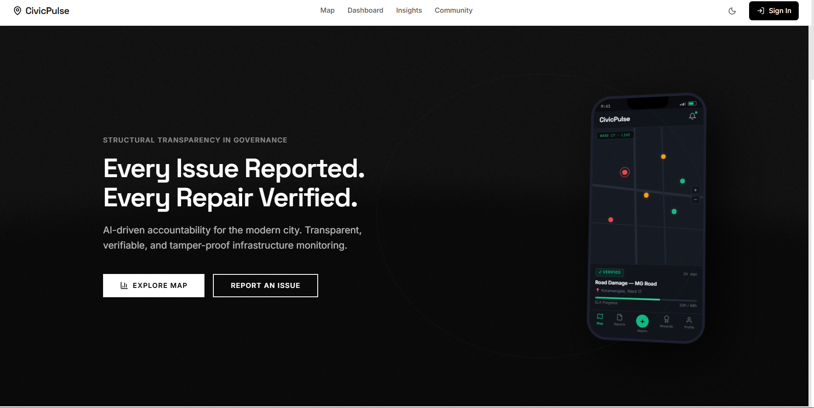 | Landing portal containing dynamic statistics, recent logs, and the warden leaderboard. |
| **Interactive Map** |  | Geographic ward ledger showing reported concerns mapped dynamically across city districts. |
| **Report Hazard** | 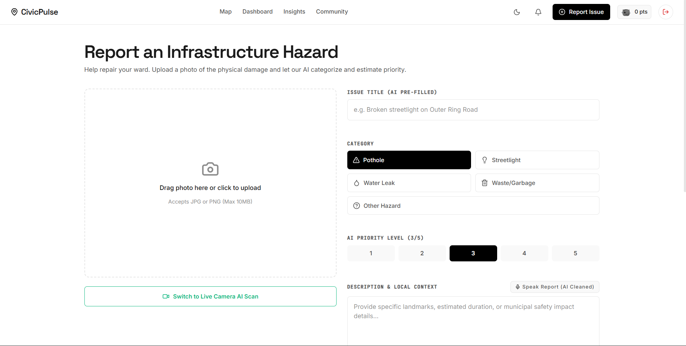 | Interactive filing form with live camera simulation, speech cleaning, and checkpoint options. |
| **Community Board** | 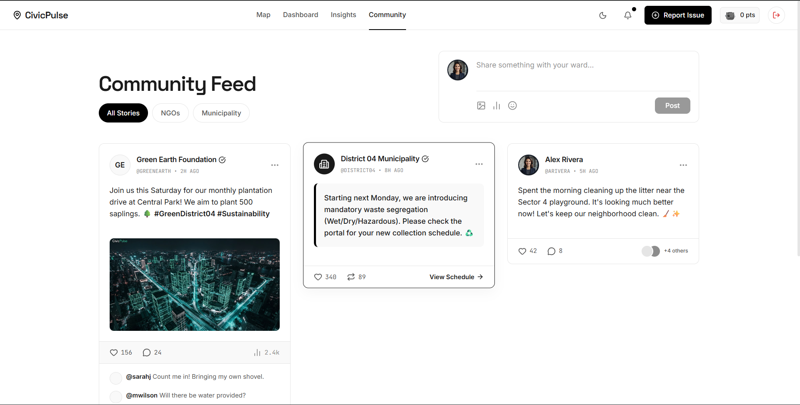 | Real-time public discussion forum for neighborhood wards, sortable by category and date. |
| **Citizen Dashboard** |  | Ward queue page displaying active resolutions, before/after visual verification, and municipal escalations. |
| **Admin Dashboard** | 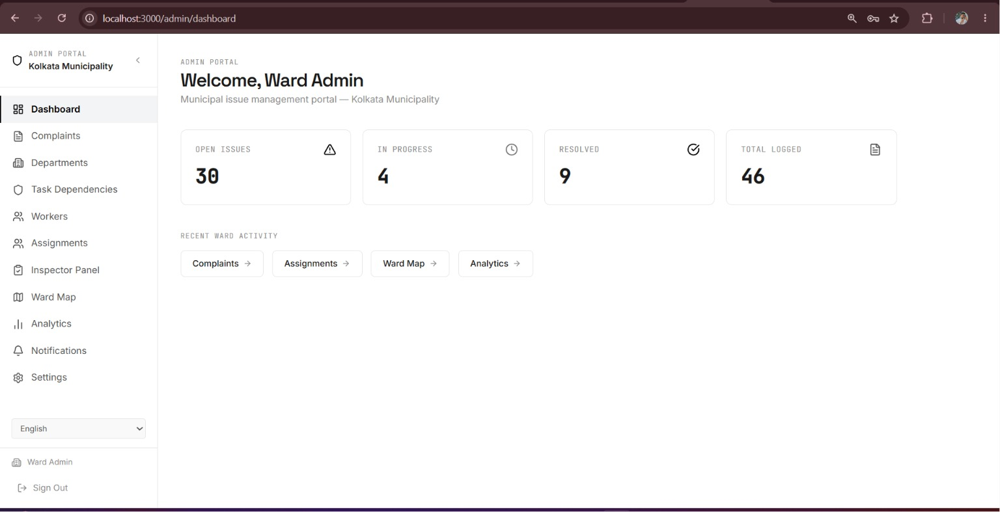 | High-level municipal overview showing active/resolved issues, open tasks, and quick navigation modules. |
| **Admin Complaints** | 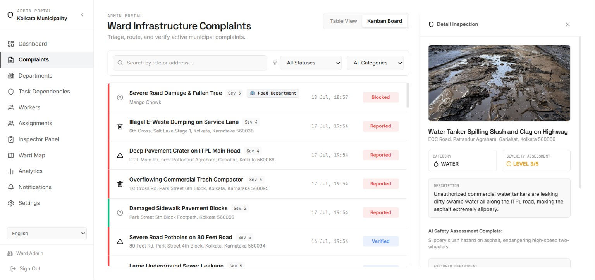 | Ward infrastructure complaints overview page with a detail inspection and triage drawer open. |
| **Admin Task Dependencies** | 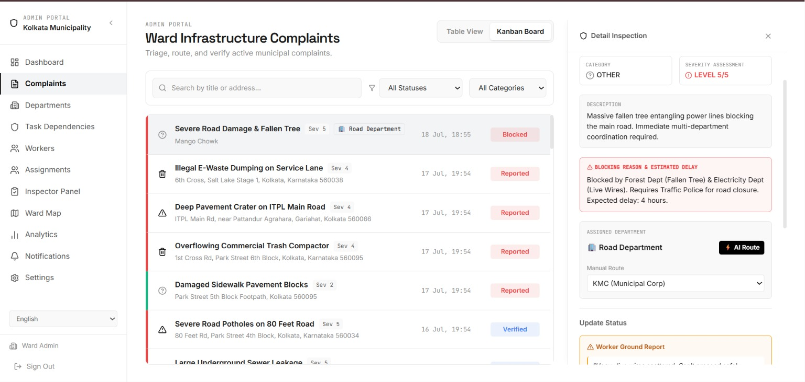 | Detail view showing inter-departmental blocking tasks (e.g. Traffic Police vs. Forest Department) and AI routing. |
| **Admin Departments** | 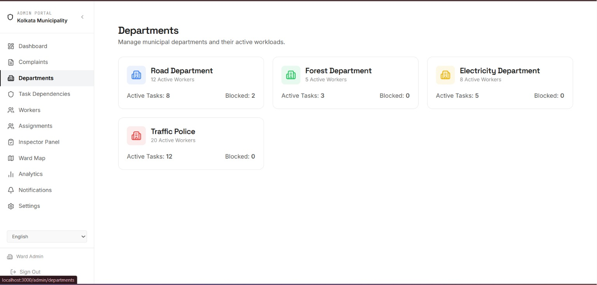 | Active workloads, worker count, and blocked tasks count broken down by municipal department. |
| **Admin Analytics** | 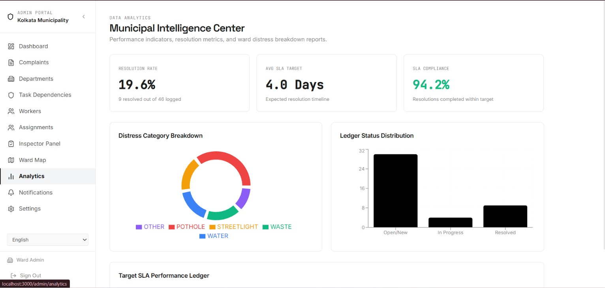 | Municipal Intelligence Center displaying resolution rates, SLA compliance metrics, and distress category breakdowns. |
| **Super Admin Municipalities** | 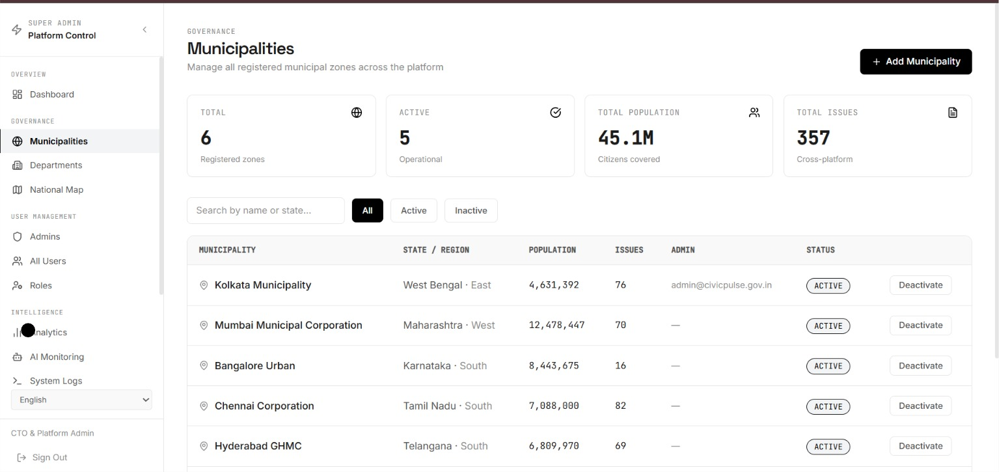 | Governance view to add, track, and manage operational municipalities (Kolkata, Mumbai, Bangalore, Chennai, Hyderabad). |
| **Super Admin AI Monitoring** | 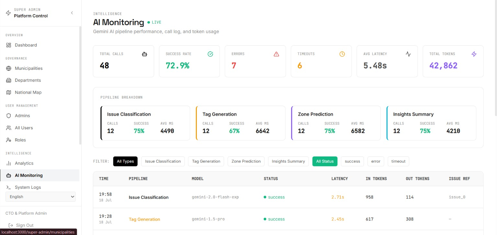 | Real-time monitoring log dashboard showing Gemini AI pipeline health, latency, token usage, and status breakdown. |
| **Super Admin Analytics** | 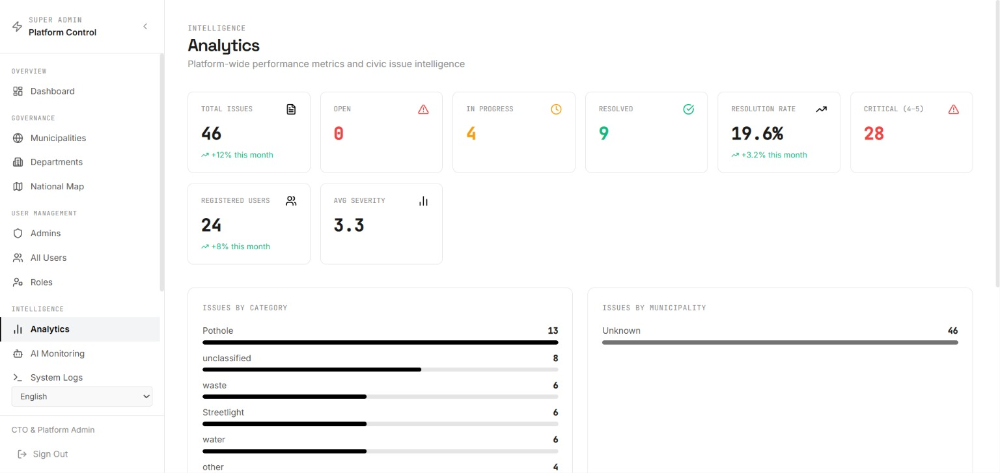 | Platform-wide performance and cross-municipality issue density metrics. |

### 📊 Application Functional Flow

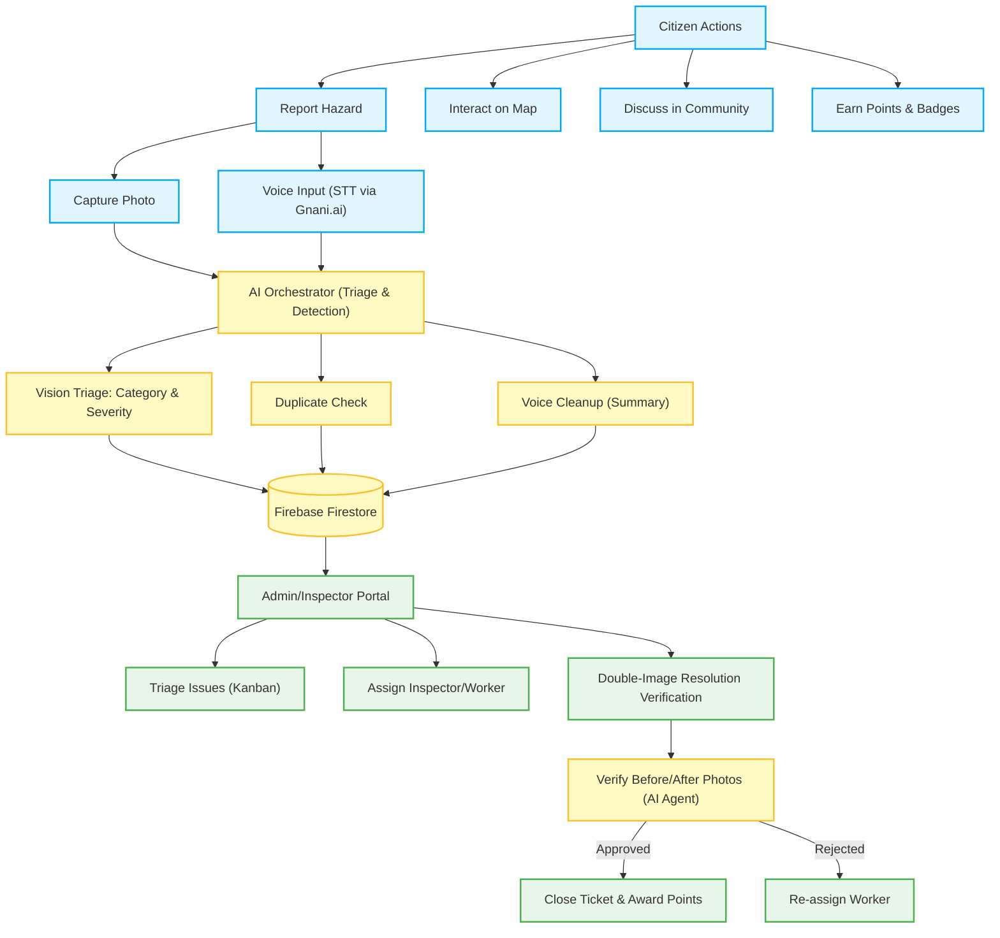

---

## 🚀 Key Features

### 📍 Geographic & Live Location Integration
*   **Ward Integration**: Mapped neighborhood ledger focused on key Kolkata wards (with a default Kolkata seed), supporting manual map plotting, auto-address resolution, and custom landmark aligners.
*   **Live Location Module**: Precision-5 geohashing and interactive locality pickers to accurately map hazards and dispatch repair crews.

### 🤖 AI Agent Architecture & Telemetry
CivicPulse utilizes a sophisticated array of Gemini-powered agents for automated triage and validation:
*   **Vision Triage (Predictive Agent)**: Scans submitted photos, determines category tags (e.g., `pothole`, `streetlight`, `water`, `waste`), grades severity (1-5), and computes target completion SLAs.
*   **Voice Cleanup (Summary Agent)**: Transforms raw speech transcript inputs from citizen voice descriptions into concise, structured titles and summaries.
*   **Dual-Image Verification (Verification Agent)**: Performs side-by-side comparison of "before" and "after" photos to verify and auto-close resolved tickets.
*   **Duplicate Detection (Duplicate Agent)**: Detects nearby issues within a geohash radius and merges duplicate reports using Gemini Vision.
*   **Weather Intelligence (Weather Agent)**: Fetches real-time weather data and posts geohash-specific flood alerts to affected citizens.

> [!NOTE]
> **API Fallback Mode**: If `GEMINI_API_KEY` is not present or rate-limited, CivicPulse transitions to local deterministic simulation models, permitting local developers to fully test the interface flows without external credentials.

### 🛡️ Admin & Super-Admin Portals
*   **Role-Based Access Control (RBAC)**: Secure access routes configured for citizens, inspectors, admins, and super-admins.
*   **Comprehensive Dashboards**: 14+ management pages including Kanban boards, escalation details, worker assignments, system logs, API key management, and municipality oversight.

### 🌍 Multilingual Support
*   **Localized Context**: Built-in `LanguageContext` supporting live UI translations across English (`en`), Hindi (`hi`), and Bengali (`bn`) for inclusive citizen access.

### 🎮 Gamified Citizen Engagement
*   **Points Engine & Leaderboard**: Citizens earn points (+50 for reporting, +120 for verifying resolution) to unlock civic badges (e.g., Civic Champion, Community Guardian) and climb the municipal leaderboard.

---

## 🤝 Partner Integrations

CivicPulse is powered by a robust ecosystem of specialized partner technologies to deliver a production-grade, highly resilient experience:

| Partner | Integration Layer | Purpose / Core Functionality |
|---------|-------------------|------------------------------|
| **Gnani.ai Voice** | WebSocket PCM Proxy | Proxies raw audio frames from the browser microphone Upgrade request via Express gateway to `wss://api.vachana.ai/stt/v3/stream` to perform real-time speech-to-text. |
| **Mem0 AI** | `mem0ai` client | Powers the personalized user memory layer. Stores and retrieves user-scoped feedback history, reporting behavior, and chat context. |
| **Keploy** | `keploy.yml` | Automates end-to-end integration test generation, capturing and replaying network and API dependencies. |

### 🎙️ Real-time Voice STT Telemetry Flow
For live reporting, raw microphone audio frames are streamed from the client directly to the Express gateway, which proxies the payload upstream via WebSocket to ensure secure header transit.

```text
[Browser Microphone] ──(Raw PCM 16kHz)──> [Express Gateway (/ws/gnani)] ──(Auth Key Header)──> [Vachana API (wss://)]
```

## ⚙️ Configuration

The following environment variables configure the application:

| Variable | Description | Required | Default / Note |
|----------|-------------|----------|----------------|
| `GEMINI_API_KEY` | Server Gemini AI Studio Key | Yes | Required for AI vision, voice cleanup, and agent orchestration. |
| `VITE_FIREBASE_API_KEY` | Firebase Web Client API Key | Yes | Required for database & auth connection. |
| `VITE_FIREBASE_AUTH_DOMAIN` | Firebase Web Auth Domain | Yes | Configures Firebase authorization domain. |
| `VITE_FIREBASE_PROJECT_ID` | Firebase Project ID | Yes | Identifies target Firebase DB/Storage. |
| `VITE_FIREBASE_STORAGE_BUCKET` | Firebase Storage Bucket | Yes | Bucket name for storing reports and images. |
| `VITE_FIREBASE_MESSAGING_SENDER_ID`| Firebase Messaging Sender ID | Yes | Used for push notifications. |
| `VITE_FIREBASE_APP_ID` | Firebase Web App ID | Yes | Client application ID. |
| `VITE_GOOGLE_MAPS_API_KEY` | Google Maps Platform API Key | No | Optional key to query Maps API for address names. |
| `DISABLE_ORCHESTRATOR` | Disables Local Background Agent orchestrator | No | Set to `true` locally to run without credentials. |
| `GROQ_API_KEY` | Groq Platform API Key | No | Used for Llama fallback retry sequence. |
| `OPENROUTER_API_KEY` | OpenRouter API Key | No | Used for OpenRouter-routed fallback models. |
| `NVIDIA_NIM_API_KEY` | NVIDIA NIM API Key | No | Used for NVIDIA-hosted fallback models. |
| `GNANI_API_KEY` | Gnani.ai STT Voice API Key | No | Powers WebSocket PCM real-time translation proxy. |
| `MEM0_API_KEY` | Mem0 AI Platform API Key | No | Powers personalized user memory logs. |
| `ANTHROPIC_API_KEY` | Anthropic Console API Key | No | Powers Claude model fallbacks in `geminiRetry.ts`. |

---

## 📋 Directory Structure

```text
├── server.ts                  # Express server & API routes
├── firestore.rules            # Security rules for Firestore database
├── firebase-applet-config.json # Applet metadata configuration file
├── security_spec.md           # Zero-trust compliance rules and architecture guidelines
├── vitest.config.ts           # Vitest testing configuration
├── .npmrc                     # Node package manager configurations (peer dependency handlers)
├── src/
│   ├── main.tsx               # App mount script
│   ├── App.tsx                # Main router & layout configuration
│   ├── pages/                 # Core page views (Map, Report, Dashboard, Insights, Admin)
│   ├── components/            # Shared UI components (Navbar, Error boundary, LocalitySelect)
│   ├── contexts/              # Authentication, User State, & Language contexts
│   ├── agents/                # Server-side Gemini AI Orchestration (Verification, Summary, etc.)
│   ├── i18n/                  # Multilingual translation dictionaries (en, hi, bn)
│   └── utils/                 # Points/reward scoring engine, geohashing, and Firebase seeders
```

---

## 🔧 Troubleshooting & FAQ

* **Interactive Map is Blank (Beige canvas)**
  Ensure your deployment environment's Content-Security-Policy (CSP) headers allow connections to `basemaps.cartocdn.com` for vector tile JSON loading.
* **Camera Access Blocked in Live Scan**
  Modern browsers restrict device access (Camera, GPS) to secure contexts (HTTPS or localhost). If running inside an iframe or non-secure HTTP, CivicPulse will automatically switch to a high-fidelity visual simulation engine.
* **Vachana STT Connection Fails**
  Check that `GNANI_API_KEY` in your `.env` is correct. If absent, the gateway reverts to a demo voice simulator to showcase real-time translation features.

---

## 📄 License

This project is licensed under the MIT License.
